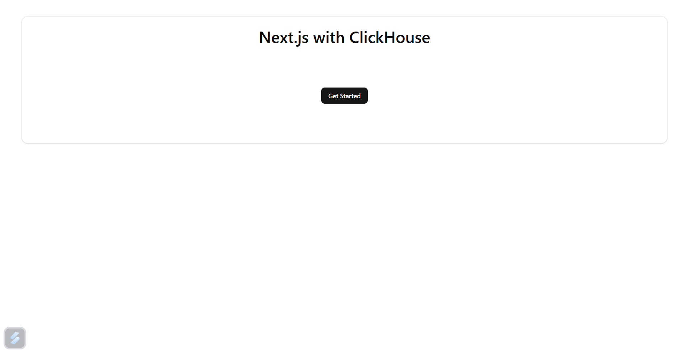
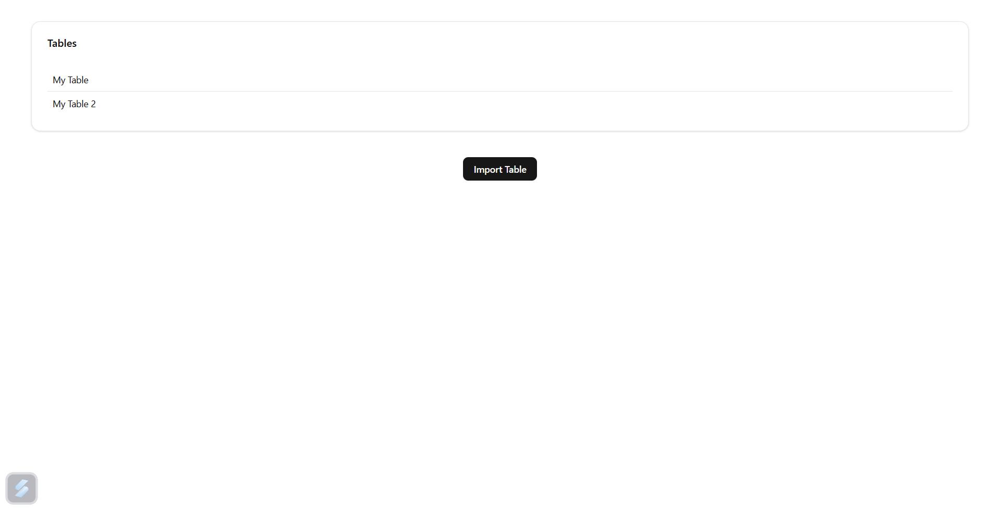
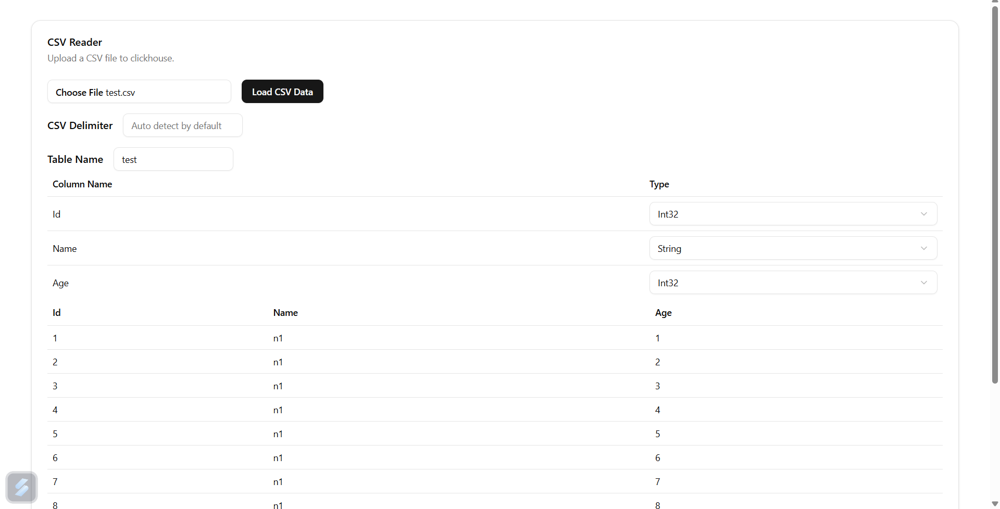
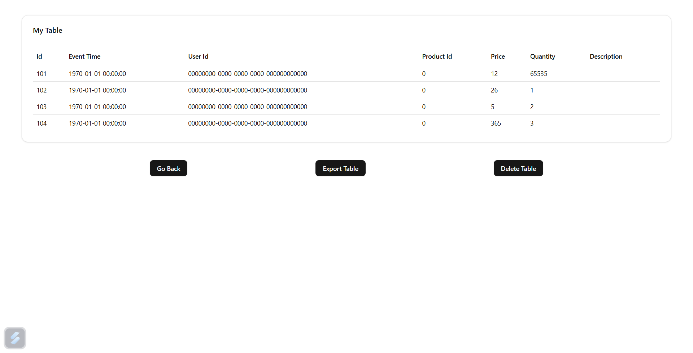
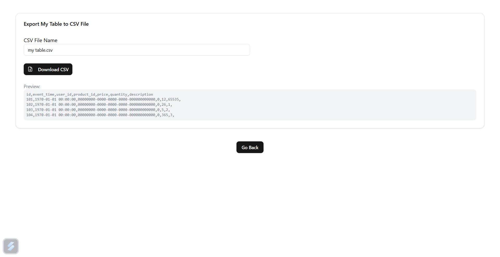

# Fullstack-with-ClickHouse-Integration

For setup you only need docker on your device

To Start Application run `docker-compose up -d --build`

The Application will start running at http://localhost:3000

Accessing the Applications:

- ClickHouse Web UI: http://localhost:8123
- Node.js Server API: http://localhost:5000/api/tables
- Next.js Frontend: http://localhost:3000

### Snapshots

